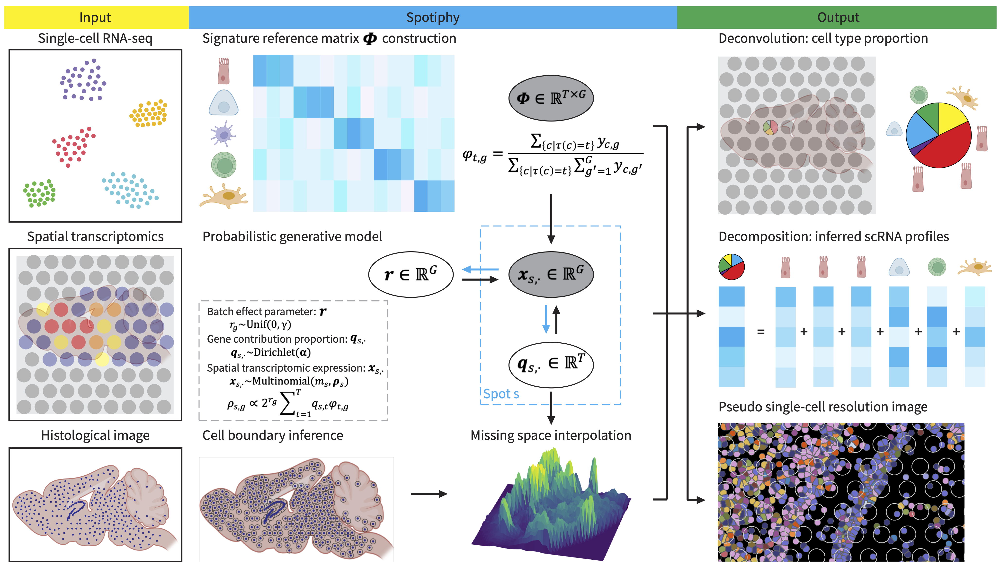

.. Spotiphy documentation master file, created by
   sphinx-quickstart on Tue Dec  5 11:26:42 2023.
   You can adapt this file completely to your liking, but it should at least
   contain the root `toctree` directive.

.. include:: _contributors.rst

Spotiphy!
====================================
|Stars| |PyPI| |PyPI_downloads| |Open_in_colab|

.. |PyPI| image:: https://img.shields.io/pypi/v/spotiphy
   :target: https://pypi.org/project/spotiphy/
.. |PyPI_downloads| image:: https://static.pepy.tech/badge/spotiphy
   :target: https://pepy.tech/project/spotiphy
.. |Stars| image:: https://img.shields.io/github/stars/jyyulab/Spotiphy
   :target: https://github.com/jyyulab/Spotiphy/stargazers
.. |Open_in_colab| image:: https://colab.research.google.com/assets/colab-badge.svg
   :target: https://colab.research.google.com/github/jyyulab/Spotiphy/blob/main/tutorials/Spotiphy_tutorial_1.ipynb

.. toctree::
   :maxdepth: 2
   :hidden:
   :caption: General

   install
   tutorials
   questions
